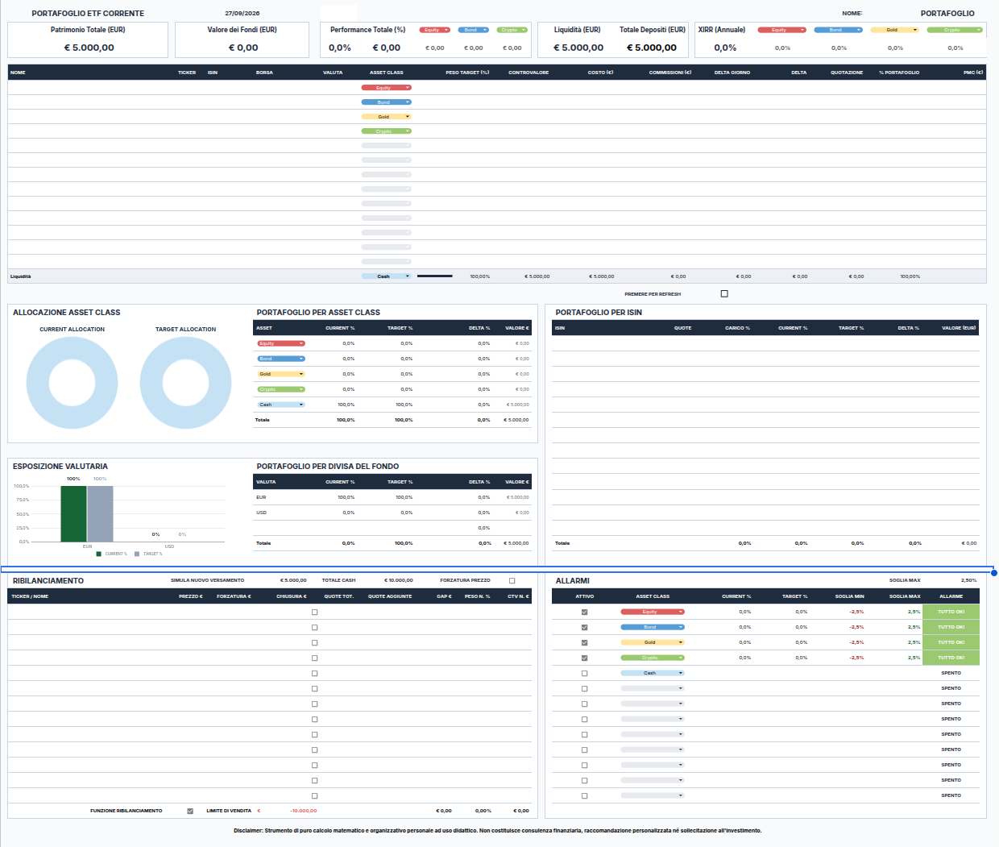
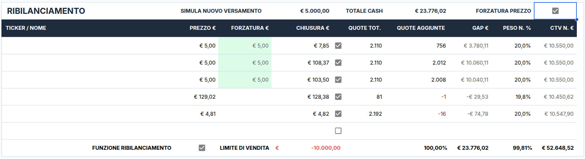
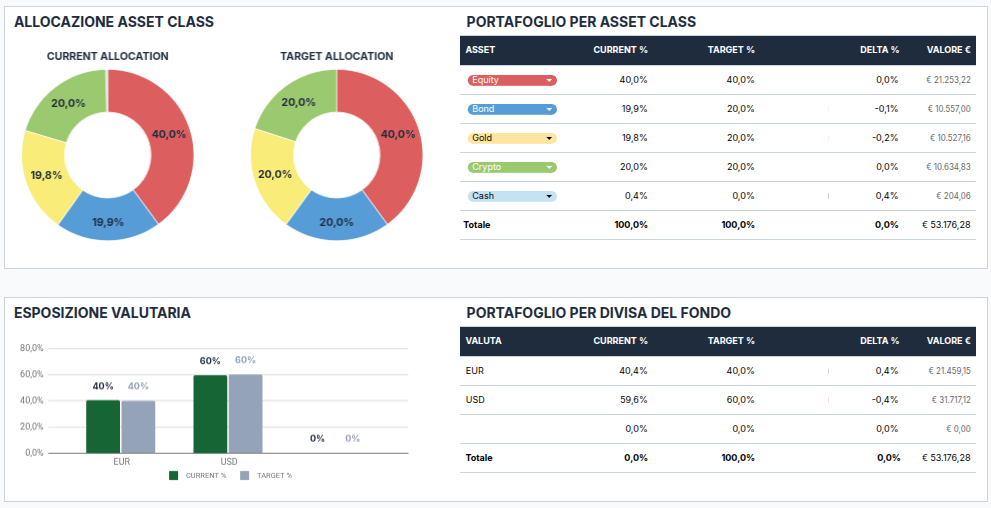
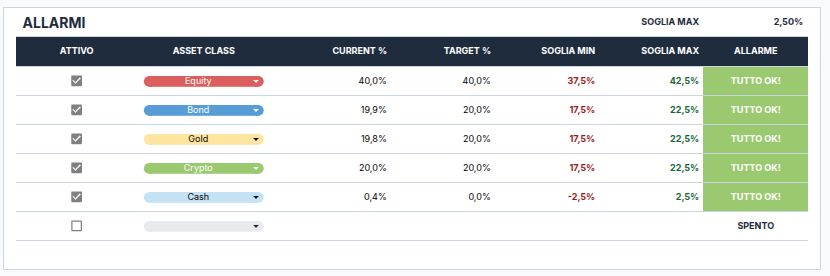
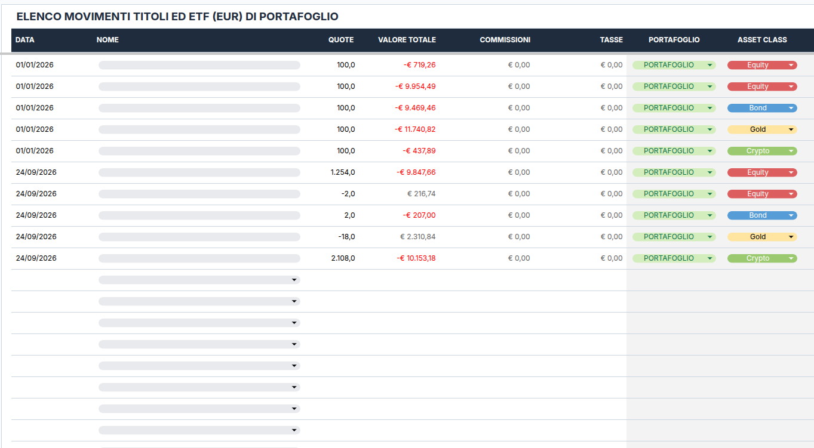

# Portfolio Tracker & Rebalancing
Foglio Google Sheets con procedure Apps Script per gestire il bilanciamento e gli allarmi di portafoglio.

Scarica l'ultima versione: [Rilasci](https://github.com/massimocoladarci/portfolio-tracker/releases/latest)

---

## Foglio di calcolo per il ribilanciamento del portafoglio ETF

Inserisci la liquidità da versare e calcola le quote da acquistare per allineare il portafoglio all'asset allocation prefissata, evitando disinvestimenti non necessari.

Questo template per Google Sheets è sviluppato come strumento matematico di supporto per gli investitori che gestiscono acquisti periodici (PAC) o ribilanciamenti tramite flussi di cassa.

### 👉 Funzionalità principali

- **Dashboard e Ribilanciamento Automatico:** inserisci la liquidità disponibile e l'algoritmo calcola esattamente quante quote acquistare per ciascun ETF per riportare il portafoglio ai pesi prefissati.
- **Console Operativa Integrata:** una sidebar laterale dedicata per aggiornare i dati e registrare gli ordini generati nello storico con un solo comando.
- **Registro Transazioni & Scalare:** archivio acquisti/vendite con calcolo automatico del Prezzo Medio di Carico (PMC) e gestione separata dei movimenti di liquidità.
- **Prezzi Aggiornati (Yahoo Finance):** recupero automatico delle quotazioni correnti dei tuoi ETF e fondi tramite integrazione con Yahoo Finance, con supporto nativo agli strumenti quotati sulle borse europee (Borsa Italiana, XETRA, Euronext).
- **100% Locale, Trasparente e Sicuro:** codice Apps Script totalmente aperto e verificabile. Nessun dato lascia il tuo account Google Drive: tutto gira esclusivamente sul tuo foglio personale.
- **Dimensionamento Realistico:** Gestione contemporanea fino a 13 posizioni ETF (+ Liquidità) con calcolo automatico dei pesi in tempo reale. Copre le esigenze di portafogli passivi diversificati mantenendo la griglia compatta e leggibile.
- 💻 **Architettura Single-Page e Grafica Curata:** Tutte le metriche decisionali sono visibili a colpo d'occhio in un unico foglio operativo compatto, ottimizzato per essere utilizzato a schermo intero come una web application autonoma, senza navigazione tra schede multiple.
- **Guida Rapida PDF:** istruzioni passo-passo per clonare il file sul tuo Google Drive e configurarlo in 5 minuti. [[SCARICA LA GUIDA](https://github.com/massimocoladarci/portfolio-tracker/releases/latest/download/Portfolio.Tracker.And.Rebalancing.pdf)]

### 👉 Dettagli Interfaccia

#### Motore di Ribilanciamento

#### Asset Allocation & Monitoraggio Allarmi
| Allocazione & Valute | Sistema Allarmi Soglie |
| :---: | :---: |
|  |  |

#### Registro Storico Movimenti

### 🔒 Trasparenza & Permessi

Per utilizzare l'aggiornamento automatico dei prezzi e la registrazione automatizzata tramite la Console, Google Sheets chiederà l'autorizzazione all'esecuzione degli script al primo avvio. È un passaggio standard di sicurezza di Google: il codice è interamente consultabile da te e non effettua chiamate verso server terzi. Il foglio può comunque essere utilizzato al 100% in modalità manuale, senza attivare gli script.

L'aggiornamento automatico dei prezzi sfrutta gli endpoint pubblici di Yahoo Finance per garantire la copertura dei ticker europei (spesso carenti su Google Finance nativo). Non sono necessarie API key a pagamento. Trattandosi di un servizio terzo gratuito, la disponibilità e i tempi di aggiornamento dipendono dai server della piattaforma fornitrice.

### 💻 Requisiti Necessari

- Un account Google (gratuito) per copiare il foglio sul tuo Google Drive ed utilizzarlo via browser.
- Connessione internet attiva per il recupero automatico delle quotazioni.

### 💬 Feedback, Supporto e Contatti

Il tuo riscontro è prezioso per migliorare il progetto! Contattami per:
* Richieste di nuove funzionalità
* Commenti e suggerimenti
* Domande generali sull'uso del foglio
* Segnalazione di bug o errori di calcolo

> Puoi aprire direttamente una **[Issue su GitHub](../../issues)** oppure scrivermi tramite il form sulla **[Landing Page Ufficiale](https://portfolio-tracker-rebalancing.carrd.co/)**.

### ⚖️ Disclaimer & Note d'Uso (Clausola AS-IS)

_Questo template è uno strumento di calcolo matematico e organizzazione personale fornito a solo scopo didattico e informativo._

- **Nessuna consulenza:** Questo strumento non costituisce né intende sostituire in alcun modo un servizio di consulenza finanziaria personalizzata, sollecitazione al pubblico risparmio o raccomandazione di investimento ai sensi della normativa vigente. Ogni scelta di allocazione e acquisto di strumenti finanziari resta sotto la totale ed esclusiva responsabilità dell'utente.
- **Fornitura "Così com'è" (AS-IS)**: Il foglio è fornito nello stato di fatto e di diritto in cui si trova, senza garanzie esplicite o implicite di funzionamento ininterrotto, assenza di errori, accuratezza dei dati di terze parti (es. API Google Finance / Yahoo) o idoneità a scopi specifici. L'autore declina espressamente ogni responsabilità per eventuali perdite economiche, danni diretti o indiretti derivanti dall'uso o dall'impossibilità d'uso dello strumento.
   
**Progetto open / distribuito liberamente a fini didattici e di studio.**

Licenza: Rilasciato sotto licenza MIT. Consulta il file `LICENSE` per i dettagli completi.

---

v1.0
